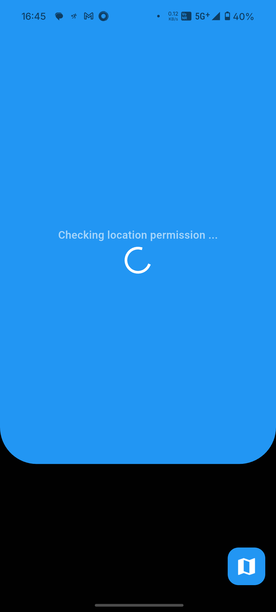
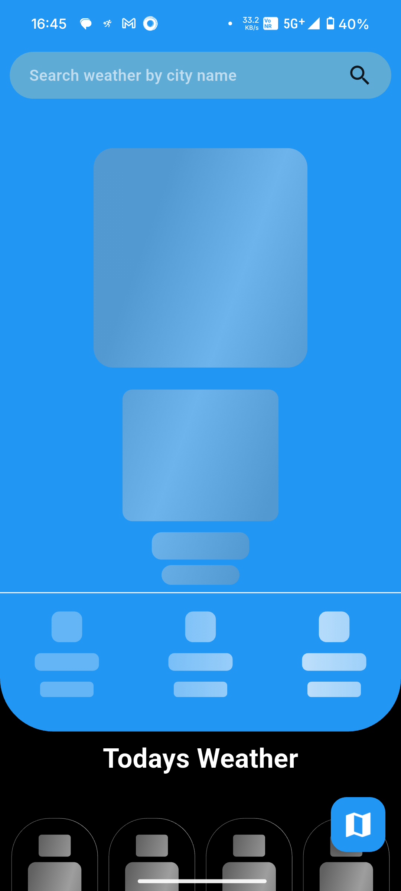
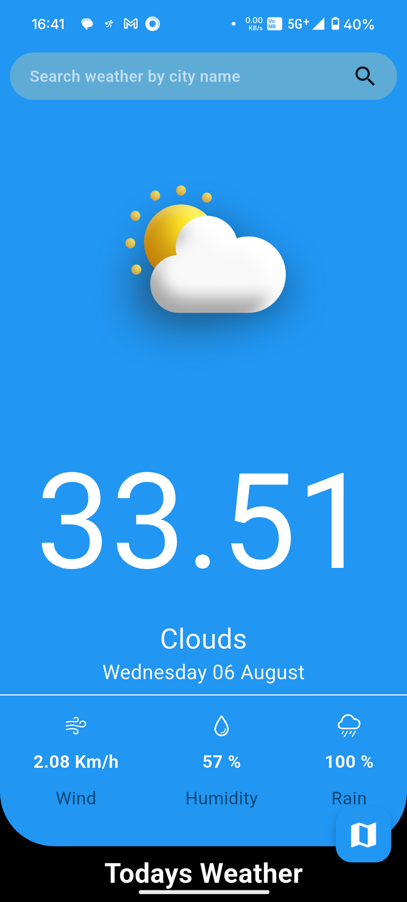
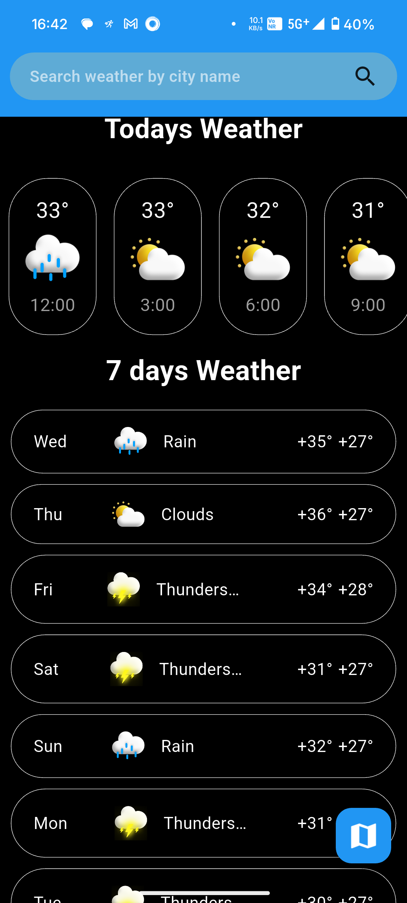
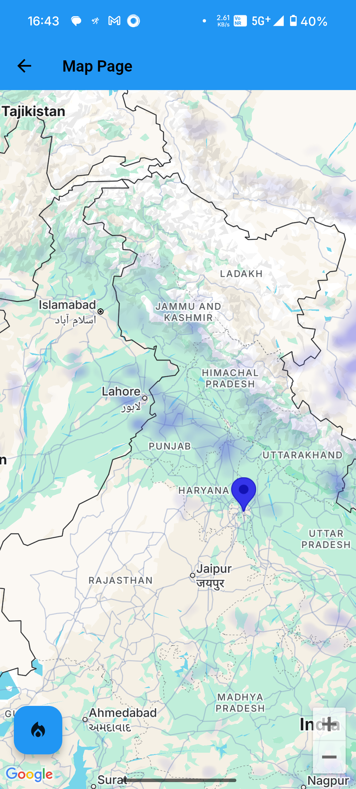
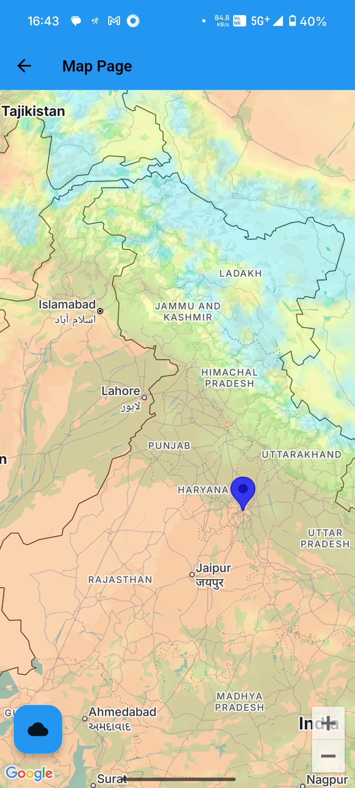
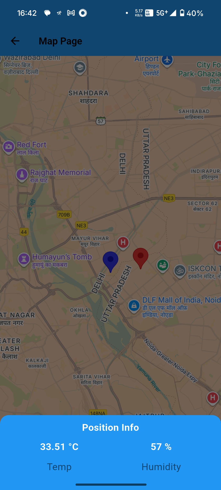
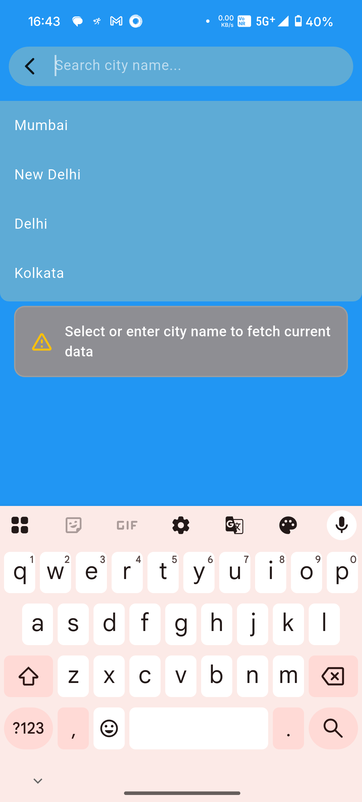
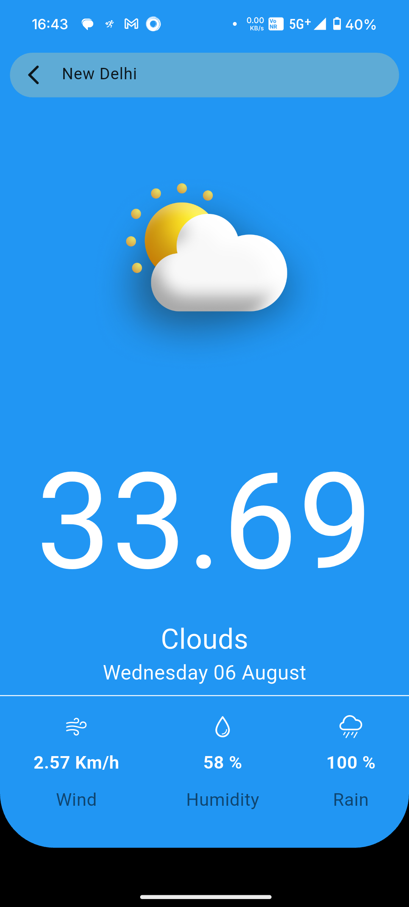
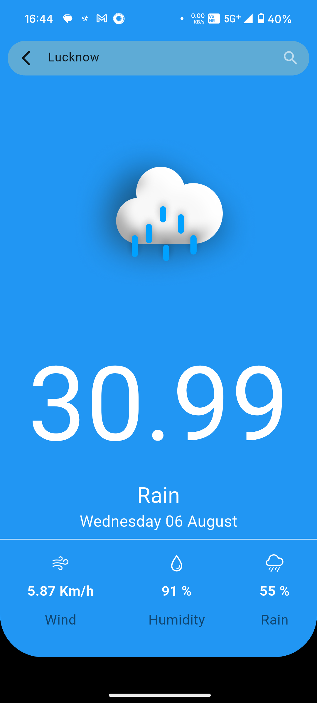

# weather_forecasting

A Weather Forecate app using Goole map kay and open weather api

## Getting Started

This project is a starting point for a Flutter application.

A few resources to get you started if this is your first Flutter project:


# Weather Forecasting App

## Overview
This Flutter application provides real-time weather data and a 5-day forecast based on the user's location. It features a visually appealing UI, seamless navigation, and robust architecture using Bloc for state management.


## Features & Navigation
- **Home Page**
  - Shows the current temperature, weather condition, and a relevant weather icon (e.g., sunny, rainy, etc.).
  - Displays a visually appealing 7-day forecast with easy-to-read UI elements.
  - Uses GPS to automatically detect your location.
  - To go to the Map Page, tap the map icon/button in the app bar or navigation drawer.
  - To search for a city, tap the search icon in the app bar.

- **Search Screen**
  - Enter a city name in the search field and submit.
  - The app fetches weather data for the entered city and updates the Home and Map pages accordingly.
  - If the city is not found or the input is invalid, an error message is shown (e.g., "City not found" or "Please enter a valid city name").
  - If there is a network or API error, a user-friendly error message is displayed and the user can retry or go back.

- **Map Page**
  - Displays Google Maps with a weather overlay for precipitation and temperature.
  - Shows a blue marker at your current or selected location.
  - When you tap the marker, it changes to a red icon and displays an info window or bottom sheet with the current temperature and humidity for that location.

- **Error Handling**
  - Network failures, API errors (invalid key, rate limits), location permission denial, and invalid input are all handled gracefully with user-friendly error messages.
  - On the Search screen, errors are shown as dialogs or inline messages, and the user can retry or correct their input.

- **Architecture**
  - Follows SOLID principles and clean code guidelines for maintainability and scalability.
  - Uses Bloc for robust and scalable state management.

- **Testing**
  - Includes unit and widget tests for Bloc logic, utility functions, and key widgets (see `test/` folder).


## Assignment Satisfaction
- All required features are implemented:
  - Real-time weather and 7-day forecast
  - Location management (GPS and manual search)
  - Map with weather overlays and interactive markers
  - Seamless navigation between Home and Map pages
  - Robust error handling
  - Clean architecture and Bloc state management
- API keys are managed securely using `dart-define` and are not committed to source code.
- Screenshots and demo video should be added as indicated below to demonstrate all major features and flows.

## Screenshots
<!-- Add screenshots of Home Page, Forecast Overview, Map Page, Error States -->

## 🔐 Permission Check Screen


## 🏠 Home Screen
               


## 🗺️ Map Screen

               


## 🔍 Search Screen

               


## 🎥 App Demo (Google Drive)

▶️ [Watch Demo Video](https://drive.google.com/file/d/1igLqyYrAnqh5qP2SiERs7AjklHubjt2c/view?usp=sharing)


## Setup Instructions
1. **Clone the repository:**
   ```bash
   git clone https://github.com/shivmanish/weatherapp.git
   cd weatherapp
   ```
2. **Install dependencies:**
   ```bash
   flutter pub get
   ```
3. **Configure API Key:**
   - Pass you map api key in manifest
   - Pass your API key using `--dart-define`:
     ```bash
     flutter run --dart-define=WEATHER_API_KEY=your_api_key
     ```
   - Or use VS Code launch configurations (see `.vscode/launch.json`).
4. **Run the app:**
   ```bash
   flutter run --dart-define=WEATHER_API_KEY=your_api_key
   ```
5. **Build APK (for mobile):**
   ```bash
   flutter build apk --dart-define=WEATHER_API_KEY=your_api_key
   ```
6. **Run tests:**
   ```bash
   flutter test
   ```

## Architectural Decisions
- **State Management:** Bloc is used for predictable, scalable state management. Bloc separates business logic from UI, making the app maintainable and testable.
- **Project Structure:**
  - `lib/` contains core logic, features, and UI.
  - `test/` contains unit and widget tests.
  - Follows clean architecture: domain, data, presentation layers.
- **Error Handling:** All API and location errors are handled gracefully with user feedback.
- **API Key Management:** API keys are injected via environment variables (`dart-define`).


## How to Run
- See Setup Instructions above.
- For mobile: install APK on device.

## Tests
- Run all tests with `flutter test`.
- Critical logic and widgets are covered.

